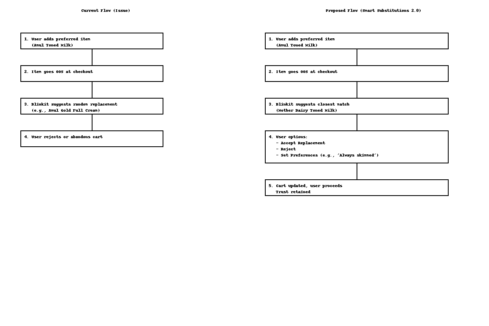

# 🛒 Smart Substitutions 2.0 for Blinkit
**Case Study: Personalized Auto-Replacements for Quick-Commerce**

---

## 🔍 Problem Statement
Blinkit and other quick-commerce apps face **out-of-stock (OOS)** issues.  
Current replacements are **generic** and often irrelevant to user preferences (e.g., dietary needs, brand loyalty).  

This results in:  
- Low substitution acceptance  
- Cart abandonment 🚫  
- Decline in customer trust 😕  

---

## 👤 User Persona

**Ankit, 30, Tech Professional**  
- Weekly grocery shopper on Blinkit  
- Loyal to toned/skimmed milk  
- Frustrated when Blinkit replaces with full-cream milk  
- Wants personalized substitutions based on **his past purchases**  

---

## 🗺️ Current Flow (Issue)

1. User adds preferred item to cart  
2. Item goes OOS at checkout  
3. Blinkit suggests random replacement (e.g., Amul Gold Full Cream)  
4. User rejects → Cart abandoned  

---

## 💡 Proposed Solution: Smart Substitutions 2.0

**Personalized Auto-Replacement Engine**  
- Learn from user **purchase history**  
- Allow **substitution preferences** (e.g., always toned milk, never full-cream)  
- Provide **closest brand/type match** instead of random alternatives  

### Features
✅ Preference Settings → “Always substitute toned milk, never with full cream”  
✅ History-Based Matching → Suggest items user frequently buys  
✅ Transparency → Tag: *“Suggested replacement based on your past orders”*  

---

## 🎨 Wireframes  

**Current Flow vs Proposed Flow**  

  

---

## 📊 Success Metrics (KPIs)

- 📉 **Cart Abandonment Rate** ↓ 15%  
- 🔁 **Substitution Acceptance Rate** ↑ >50%  
- 😊 **NPS (Net Promoter Score)** +10 points (trust in Blinkit)  
- 📈 **Repeat Purchases** ↑ 20%  
- 📉 **Support Tickets (OOS complaints)** ↓ 25%  

---

## 🚀 Roadmap

**Phase 1 (MVP, 2 months)**  
- Track purchase history (per user, per category)  
- Suggest same-brand or closest-category replacements  

**Phase 2 (Optimization, 4–6 months)**  
- Allow **user-defined substitution preferences**  
- Show transparency tags (“Suggested replacement”)  
- Add quick *“Always substitute with this brand”* toggle  

**Phase 3 (Future Vision, 9–12 months)**  
- AI-powered personalized substitution engine  
- Dietary filters (vegan, lactose-free, organic)  
- Community trust feature: *“90% of users accepted this replacement”*  

---

## 🧠 Key Learnings
- Personalization → higher trust + loyalty  
- Users value **control** (set rules) + **transparency** (why this replacement?)  
- Quick wins in substitution UX can directly impact revenue retention  

---

## 📌 Project Tags
`#ProductManagement` `#ECommerce` `#CaseStudy` `#Blinkit` `#UserExperience`

